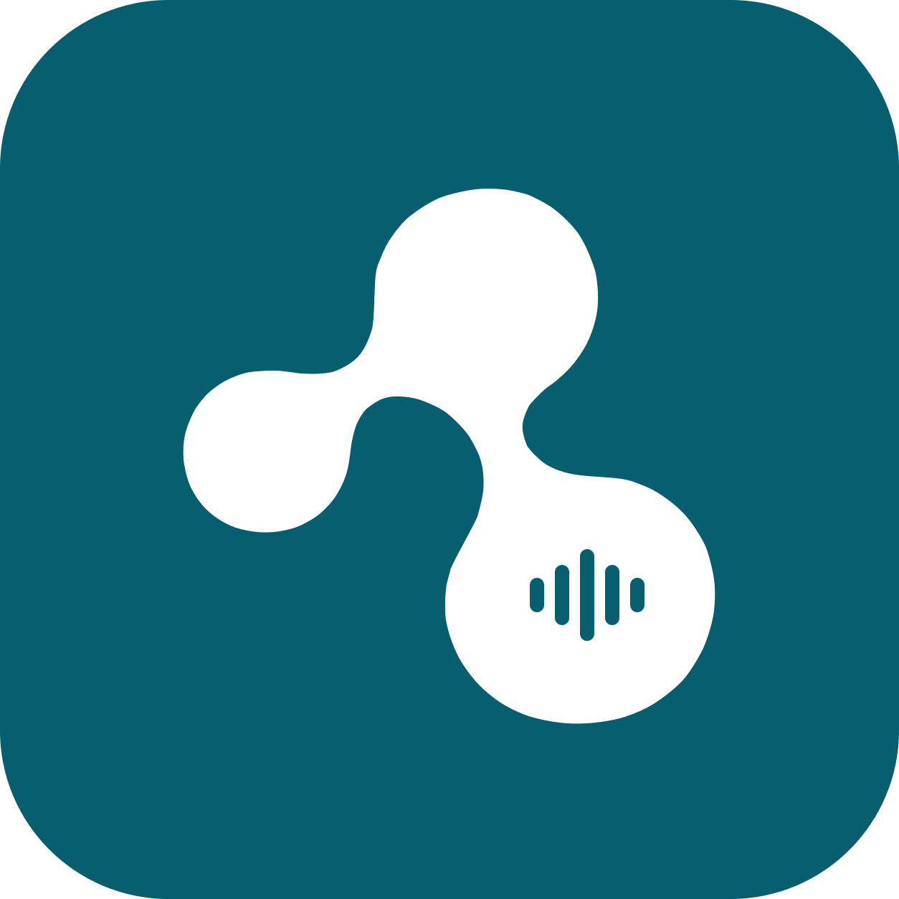

# 声邻

声邻让身边的设备在录音时自动为彼此降低媒体音量。Mac 与 iPad 配对后，任一设备开始录音，都可请求另一端降低音量；结束后恢复。Mac 也能在本机录音时降低自己的扬声器音量。菜单栏图标提供快速状态与控制。

> **早期预览版。** 目前以 Apple Silicon Mac 和 iPad 真机为开发、测试目标。iPad 的录音检测与音量控制使用系统私有接口，系统更新可能改变行为；后台、锁屏和多设备协同仍需继续验证。

## 下载与安装

macOS DMG 已制作，公开下载仍待 Developer ID 签名和 Apple 公证；届时会在 [Releases](https://github.com/xiaoland/shenglin/releases) 提供。iPad 版目前没有可供所有设备直接安装的公开包；详情见[安装与分发](manuals/安装与分发.md)。

安装后，在 iPad 上打开声邻并点“开始 2 分钟配对”；在 Mac 的“设置”→“设备”点“添加设备…”，选择 iPad 并输入它显示的六位验证码。两台 Mac 也可在设备设置中互相配对。[使用指南](manuals/使用指南.md)说明音量目标、应用排除、专用麦克风和诊断功能。

## 文档

- [使用指南](manuals/使用指南.md)：配对、日常控制和可选功能。
- [行为与限制](manuals/行为与限制.md)：录音判定、空间条件、隐私与当前边界。
- [开发与诊断](manuals/开发与诊断.md)：源码构建、驱动、CLI 与诊断工具。
- [验收记录](docs/validation.md)：真机证据和仍待验证的场景。

图标矢量稿、透明标记和菜单栏单色标记位于 [Design](Design)。项目代码使用 [MIT 许可证](LICENSE)；第三方许可证保留在 [third_party](third_party)。
